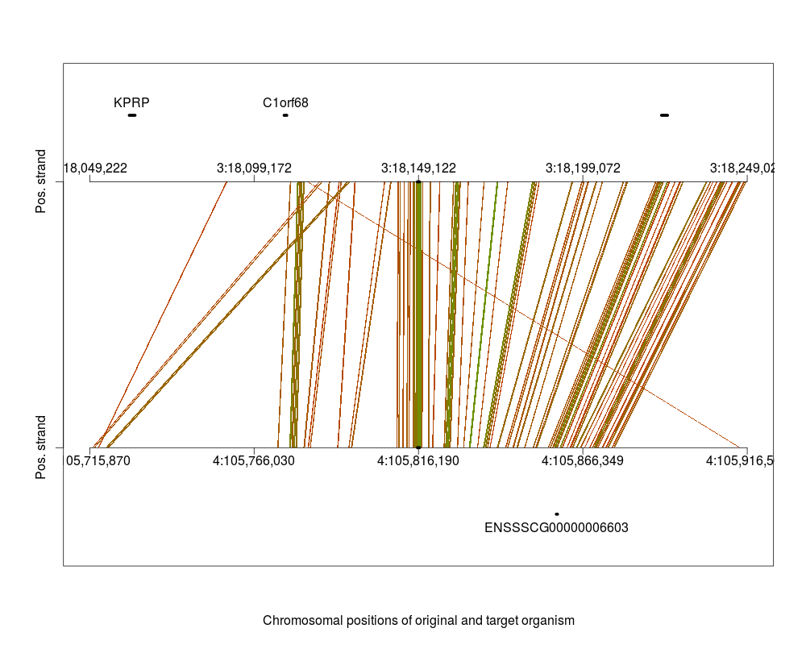
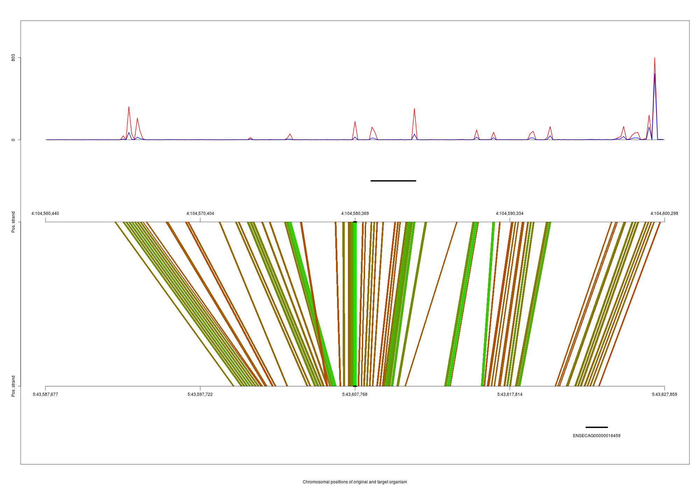

# Installation

The installation of `hoardeR` is straight forward. It is located on Cran and can be installed from within R with the 
command

```{r eval=FALSE}
install.packages("hoardeR")
```

There are no special system requirements for the installation when the package runs on
a Linux computer. To handle gz files on Windows, the command 'gzip' is used from the console and needs to be available (what should normally
be the case). There are a few package dependencies that have to be fulfilled.
Normally these dependencies are installed automatically, too. If not, missing Cran packages need to be installed prior to the
installation as above, with

```{r eval=FALSE}
install.packages("packageName")
```

and missing Bioconductor packages (e.g. the package `Biostrings`) with 

```{r eval=FALSE}
source("https://bioconductor.org/biocLite.R")
biocLite("Biostrings")
```
If during the first installation the Bioconductor are not installed, they can be installed
all together by typingwith

```{r eval=FALSE}
source("https://bioconductor.org/biocLite.R")
biocLite(c('Biostrings', 'GenomicRanges', 'bamsignals', 'IRanges', 'Rsamtools', 'snpStats'))
```


The latest developer version, of `hoardeR` is located on GitHub, here

&nbsp;&nbsp; <https://github.com/fischuu/hoardeR>

and the address on Cran with the latest stable release version is

&nbsp;&nbsp; <https://cran.r-project.org/package=hoardeR/>

A webpage for the latest news on hoardeR can be found here:

&nbsp;&nbsp; <http://hoarder.danielfischer.name>

Packages from GitHub can be installed directly from R, using the `devtools` package. To install the latest developer version of
`hoardeR` from GitHub, run the following commands

```{r eval=FALSE}
install.packages("devtools")
library("devtools")
install_github("fischuu/hoardeR")
```

Once the package is installed, it can be loaded into the namespace 

```{r, warning=FALSE, eval=TRUE}
library("hoardeR")
```

# Using hoardeR for identifying cross-species orthologs of novel candidate genes

## Typical workflow prior the use of hoardeR

The common application of `hoardeR` is to search cross-species orthologs of unannotated, but active regions in a present organism. For that typically an RNA-seq
experiment has been conducted, the reads have been mapped to a reference genome and gene expressions have been estimated using some annotation.

Further, reads from non-annotated regions have been analysed and a set of novel gene candidate regions has been identified. This can be done either
across the whole data set or individually for each sample. 

From this analysis the user has either a gtf file with novel loci (e.g. Cufflinks provides this), or then a bed file with the new loci. 

The first rows of a typical gtf file would like this:

\tiny

```{bash eval=FALSE}
1       Cufflinks       exon    242203  242862  .       +       .       gene_id "XLOC_000002"; transcript_id "TCONS_00000002"; exon_number "1"; oId "CUFF.2.1"; class_code "u"; tss_id "TSS2";
1       Cufflinks       exon    242203  242646  .       +       .       gene_id "XLOC_000002"; transcript_id "TCONS_00000003"; exon_number "1"; oId "CUFF.1.1"; class_code "u"; tss_id "TSS2";
1       Cufflinks       exon    254559  256717  .       +       .       gene_id "XLOC_000002"; transcript_id "TCONS_00000003"; exon_number "2"; oId "CUFF.1.1"; class_code "u"; tss_id "TSS2";
1       Cufflinks       exon    254240  256717  .       +       .       gene_id "XLOC_000002"; transcript_id "TCONS_00000004"; exon_number "1"; oId "CUFF.3.1"; class_code "u"; tss_id "TSS3";
1       Cufflinks       exon    341982  343630  .       +       .       gene_id "XLOC_000003"; transcript_id "TCONS_00000005"; exon_number "1"; oId "CUFF.10.1"; class_code "u"; tss_id "TSS4";
1       Cufflinks       exon    342113  342607  .       +       .       gene_id "XLOC_000003"; transcript_id "TCONS_00000006"; exon_number "1"; oId "CUFF.11.1"; class_code "u"; tss_id "TSS5";
1       Cufflinks       exon    342961  343494  .       +       .       gene_id "XLOC_000003"; transcript_id "TCONS_00000006"; exon_number "2"; oId "CUFF.11.1"; class_code "u"; tss_id "TSS5";
1       Cufflinks       exon    3312599 3313720 .       +       .       gene_id "XLOC_000024"; transcript_id "TCONS_00000073"; exon_number "1"; oId "CUFF.75.1"; class_code "u"; tss_id "TSS37";
1       Cufflinks       exon    3446776 3447142 .       +       .       gene_id "XLOC_000024"; transcript_id "TCONS_00000073"; exon_number "2"; oId "CUFF.75.1"; class_code "u"; tss_id "TSS37";
1       Cufflinks       exon    9347375 9347527 .       +       .       gene_id "XLOC_000047"; transcript_id "TCONS_00000118"; exon_number "1"; oId "CUFF.115.1"; class_code "u"; tss_id "TSS63";
```

\normalsize

The first lines of a bed file containing the same information would look like this (tab-separated):


```{bash eval=FALSE}
1       242203      242862      XLOC_000002.1
1       242203      242646      XLOC_000002.2
1       254559      256717      XLOC_000002.3
1       254240      256717      XLOC_000002.4
1       341982      343630      XLOC_000003.1
1       342113      342607      XLOC_000003.2
1       342961      343494      XLOC_000003.3
1       3312599     3313720     XLOC_000024.1
1       3446776     3447142     XLOC_000024.2
1       9347375     9347527     XLOC_000047.1
```

For the identification of cross-species orthologs, the exon structure is not the primary interest. Rather, the whole genomic region that hosts a novel candidate gene is
used here. Typically not all novel gene candidates are considered and the list is filtered according to some criteria e.g., that a certain amount of samples have to have a minimum number of reads in that region.

The final set of regions of interest is then available in bed format, e.g. like this

```{bash eval=FALSE}
1       242203      256717      XLOC_000002
1       341982      343630      XLOC_000003
1       3312599     3447142     XLOC_000024
1       9347375     9347527     XLOC_000047
```

## Extraction of nucleotide sequence of novel candidate region

For any loci of interest the nucleotide sequences have to be extracted. There are two ways to do that. The first option is to do it outside of R using e.g., bedtools. If the candidate regions have been determined within R, the bed file has to be saved to the harddrive first. Assuming a data frame that
contains the bed information is called `novelBed` and we have a defined system path to the project, called `projFolder`. The command that can be used
to export the data table in bed format is `exportBed()`. The `exportBed` function is a simple wrapper around the standard `write.table` that uses the
corrected setting to meet the requirements of a bed file.

The function expects as first argument the data frame that contains the information and then the place to where the bed file should be stored. Further,
the option `header` is available (`logical`), that determines if the first line should contain the variable names or not, as some applications require
a header line in the bed file. Example commands to export the data frame `novelBed` are

```{bash eval=FALSE}
# Write the bed file into the working directory
  exportBed(novelBed, file = "novel.bed")

# Alternative: Use a variable to define the right folder
  projFolder <- "/home/daniel/MyProjects/hoardeR-Example"
  exportBed(novelBed, file = file.path(projFolder, "novel.bed"))
```

In the console this bed file can then be used to extract the fasta files, using the `bedtools` program like this

```{bash eval=FALSE}
bedtools getfasta -fi <input FASTA> -bed novel.bed -fo novel.fa
```

Here, `<input FASTA>` is a fasta file that contains the genome information of the species under investigation. If the output file `novel.fa` is empty or
some other errors occur, a common source of error is a mislabeling of the chromosomes between the input fasta file and the corresponding bed file (e.g. leading CHR, Chr, etc.). Extracting the sequences in such a way is especially then adviceable, when the species of interest is rare or the fasta file is not available from NCBI in the latest version. Also if many sequences should be extracted, bedtools is faster then the implemented R function.

However, if the species and also the genome assembly version is available from NCBI, the fasta information can be obtained straight with the `hoardeR` function `getFastaFromBed`. The `hoardeR` package is able to directly download the genomes and annotations of the most common species, a list of available combinations can be found in the `species` dataset, that comes with `hoardeR`


```{r eval=FALSE}
species[1:6,1:5]
```
\tiny
```{r eval=TRUE, echo=FALSE, comment=NA, tidy=TRUE}
options(width = 400)
species[1:6,1:5]
```
\normalsize

Of particular interest are here the columns `Organism.Name` and `Assembly.Name`. If your species of interest and your used assembly matches with the information in the `species` table, you can use the automatic `hoardeR` function `getFastaFromBed` with the default settings to obtain your fasta object. As an example, assume that our species of interest is _Cattle_ (that has the scientific name _bos taurus_) and the fasta files should be downloaded
to the folder `/home/daniel/fasta/`. To check the available entries in the `species` table, we can use the function `findSpecies` to get specific rows in `species`. The function expects just one `string` and extracts then from the `species` object all rows that contain the string (also substrings are possible) in any of its cells. Hence, this function
can be used to find common names, scientific names or also assembly IDs.

```{r eval=FALSE}
findSpecies("Cattle")
```
\tiny
```{r eval=TRUE, echo=FALSE, comment=NA, tidy=TRUE}
findSpecies("Cattle")
```
\normalsize

This means, by default `hoardeR` uses the Cow assembly `UMD_3.1.1` if nothing else is specified.

In its most basic usage, the `getFastaFromBed` function expects a data table (parameter `bed`), a species identifier (parameter `species`) and a folder where
it finds the fasta files or to where it can save them (parameter `fastaFolder`). The function first checks from the provided folder if the required
fasta files are available, and if not it will download the corresponding files from the NCBI ftp server. The output of the function is then an object of class `fa`.

A basic minimal example of the usage of the function:

```{r eval=FALSE}
novelBed <- data.frame(Chr = c(11,18,3),
                       Start = c(72554673, 62550672, 18148822),
                       End = c(72555273, 62551296, 18149488),
                       Gene = c("LOC1", "LOC2", "LOC3"))

myFasta <- getFastaFromBed(novelBed, species = "Bos taurus", 
                           fastaFolder = "/home/daniel/fasta/")

```

The content of `myFasta` looks then like this

```{r eval=FALSE}
myFasta

$`>11:72554673-72555273`
[1] "cccaagaagcaggaatgagagtggcgctttttctgccccaggtaacggtc..."

$`>18:62550672-62551296`
[1] "aggagatttgcctgcgaaacctctggttctcttagagcttccattcccgt..."

Fasta sequences ommited to print: 1
```

To see a summary of the `fa` object, the S3 class function `summary` is available

```{r eval=FALSE}
summary(myFasta)

Summary of fa object
---------------
Sequences      : 3 
Minimum length : 601 
1st quartile   : 613 
Median length  : 625 
Average length : 631 
3rd quartile   : 646 
Maximum length : 667 
```


The function `getFastaFromBed` has more options and it is also possible to use own fasta files with it. For that, the species needs to be listed in the species data table and
the fasta files need to be located in the `fastaFolder`. The naming has to follow the convention as set from NCBI. If an own assembly is specified `hoardeR` tells the filename
under which it searches then the corresponding fasta file. For that, just provide an assembly identifier like this:

```{r eval=FALSE}
myFasta2 <- getFastaFromBed(novelBed, species = "Bos taurus", assembly="UMD_3.1",
                           fastaFolder = "/home/daniel/fasta/")
```

The internal function is especially useful for small bed files or fast testing purposes. Also, to the best of our knowledge, bedtools is not available for Windows systems. The `getFastaFromBed` function is currently under development to improve its performance especially for larger bed files and also to get access to the corresponding assembly 
archive at NCBI.

It is also possible to write out a fasta file while creating the `fa` object. For that, a folder location (option `export` and a filename (option `fileName`) needs to be specified

```{r eval=FALSE}
myFasta <- getFastaFromBed(novelBed, species = "Ovis aries",  
                           fastaFolder = "/home/daniel/fasta/",
                           export = "/home/daniel/fasta", 
                           fileName="seqFasta.fa")
```

To export an existing `fa` object from R to the harddrive, the function `exportFA` can be used. It just needs the `fa` object itself and also the filename to store it.

```{r eval=FALSE}
exportFA(myFasta, file="/home/daniel/myFasta.fa")
```

A previously stored or downloaded fasta file can be imported to `hoardeR` with the `importFA()` function:

```{r eval=FALSE}
novelFA <- importFA(file="/home/daniel/myFasta.fa")
```

The names of the fasta sequences should follow the form like

```{r eval=FALSE}
>Chr:Start-End
```

That means, for a sequence from chromosome 12 that starts at 123 and ends at 456 the fasta sequence should be named like the following.

```{r eval=FALSE}
>12:123-456
```


Currently this function should only be used for smaller fasta files like candidate sequences, but not for whole chromosomes. For that, the function
`Rsamtools::scanFa` is recommended.

## Sending sequences to NCBI

Once the fasta object is available in R, it can be send to the NCBI blast service, using the central `hoardeR` function `blastSeq()`

```{r eval=FALSE}
  blastSeq(novelFA, 
           email="daniel.fischer@luke.fi",
           xmlFolder="/home/daniel/results/hoardeR/Proj1-Out",
           logFolder="/home/daniel/results/hoardeR/Proj1-Log")
```           

The main parameters are the `fa` object that contains the sequences to be blasted (here called `novelFA`) and for etiquette reasons a valid email address of the person who sends the data to NCBI. Further, it is possible to define a folder name and location for the xml and log files on the harddrive. If the folder does not exist on the HDD, `hoardeR` will create it. If no `logFolder` is provided, it will automatically be created as a subfolder of `xmlFolder` and is called `logs`. If also no `xmlFolder` is provided, then `hoardeR` creates in the working directory a new project folder called `hoardeR` followed by a timestamp.

The `xmlFolder` stores the results that are delivered from NCBI in xml format and the `logFolder` stores the log files. These files are
especially then important, when the run crashes and should be continued or if the computer is switched off in between. During the time the computer
is switched off, obviously no new sequences are sent anymore to NCBI.

If a crashed run should be continued, it is enough to run the same command as the initially one using the same fasta object and `hoardeR`
will continue from the point, where it crashed or where it was interrupted. In case that during the previous commands no `xmlFolder` was specified and `hoardeR` created it automatically, the `xmlFolder` needs to be specified accordingly to continue from it.

If the option `verbose=TRUE` is set (default), `hoardeR` keeps 
reporting status updates of the blast runs. There are still some fine-tuning parameters available, see the manual for details. However,
there are some etiquette parameters of NCBI that cannot be changed to smaller values than the defaults. These are e.g. the frequency of the requests and the total amount of parallel blast runs.

The verbose output of a `blastSeq` runs straight after executing the command looks as follows

```{r eval=FALSE}
Missing: 3 
Running: 1 
Finished: 0 
Avg. Blast Time: NA 
Total running time: 00:00:04 
---------------------------------------------------------------
```

indicating e.g. that here are still three fasta sequences waiting to be finished, one sequence is already running at NCBI, zero are finished so
far and the running time of the whole run is 4 seconds. After a while (option `delay_rid`), `blastSeq` starts to check, if the active blast runs are
finalized. If there are still free blast slots available (maximum number is defined via `n_blast` option), `blastSeq` spawns the next ones. In that case, the verbose output looks like this:

```{r eval=FALSE}
Run RW99J31C01R : 00:02:23 
Missing: 1 
Running: 1 
Finished: 2 
Avg. Blast Time: 00:01:10 
Total running time: 00:02:40 
---------------------------------------------------------------
```

Here, we see that there is still one sequence missing and its sequence was already sent, as indicated by the fact that there is also one sequence running. The ID number of that run is `RW99J31C01R` and it is active since 2 minutes and 23 seconds. So far, two sequence runs are finished and their average running time was 1 minute and 10 seconds.

The function stops, when there are neither missing nor running sequences anymore. The results of the run are stored in the `xmlFolder`. These results
can already be analyzed while the `blastSeq` run is still active, so intermediate results can be obtained on the fly. For that, just open another instance of R and continue to analyze the Blast results.

## Analyze the Blast Results

To analyze the blast results, first the xml files have to be imported to `hoardeR`. For that there is the `importXML()` function.
It expects the folder address where the xml files are stored, in our example it is the `hoardeROut` folder in the `projFolder` folder. The output
of the function is then stored in the `xmls` object.

```{r eval=FALSE}
xmls <- importXML(folder=file.path(projFolder,"hoardeROut/"))
```

One of the first steps is to check what hit organisms were found. As naturally all sequences are also found in Bos Taurus/Cow, the
host organism can be excluded from the table with the `exclude` option.

```{r eval=FALSE}
tableSpecies(xmls, exclude="Bos taurus")
```
  
This table can be displayed as barplot e.g. in the following way

```{r eval=FALSE}
barplot(tableSpecies(xmls))
```

or with some formatting, in case more bars are to be plotted (as it is common, if many sequences were sent)

```{r eval=FALSE}
par(oma=c(5,0,0,0))
barplot(sort(tableSpecies(xmls, exclude="Bos taurus"), decreasing=TRUE), las=2)
```

The function can also summarize all hits in a certain hit organism.
For example, all hits in Pig/Sus scrofa should be printed. For that, the xml results will be first filtered accordingly. 
This time, however, a species is not excluded with the `exclude` option, but explicitely defined with the `species` parameter.
Further, instead of just counting the occurances, we request in addition the location information by setting `locations=TRUE`:

```{r eval=FALSE}
tableSpecies(xmls, species="Sus scrofa", locations = TRUE)
```

\scriptsize
```{r eval=FALSE}
                                            Organism hitID hitLen hitChr  hitStart    hitEnd origChr origStart  origEnd
15 Sus scrofa breed mixed chromosome 13, Sscrofa10.2   542    610     13 152539332 152538724       1  62550672 62551296
```
\normalsize

without the `locations=TRUE` option, the output is very minimalistic, as it just gives the frequencies:

```{r eval=FALSE}
R> tableSpecies(xmls)
  
Bos taurus Equus caballus     Sus scrofa     Ovis aries 
         6              1              1              3 
```

Especially when a single species is defined, without setting `locations=TRUE` the function just gives the frequency.         
         
```{r eval=FALSE}
R> tableSpecies(xmls, species="Sus scrofa")
Sus scrofa 
         1 
```

The column `Organism` indicates the hit organism and the corresponding assembly. In this case it is Sus scrofa and Sscrofa10.2. Cross-checking with the `species` data table using the `findSpecies()` function reveals, that this assembly is the default assembly at NCBI:
```{r eval=FALSE}
findSpecies("Sus scrofa") 
```

\scriptsize

```{r eval=FALSE}
    Organism.Name Organism.Common.Name Taxid Assembly.Name Assembly.Accession                            Assembly.Submitter    Assembly.Data  ...
317    Sus scrofa                  pig  9823   Sscrofa10.2    GCF_000003025.5 The Swine Genome Sequencing Consortium (SGSC) 7 September 2011  ...
\normalsize

That means that the assembly can be obtained automatically from `hoardeR` for further analysis without using any additional parameters. The command `getAnnotation` downloads automatically the corresponding annotation into a folder specified in `annotationFolder` (here: `/home/daniel/annotation`). Again, if nothing is specified (`annotationFolder=NULL`, default), the working directory is used intead. 

```{r eval=FALSE}
ssannot <- getAnnotation(species = "Sus scrofa", 
+                        annotationFolder="/home/daniel/annotation")
```

Having the annotation information available from NCBI, we can intersect the Blast results with the annotation. First we check if the found loci intersect with an intergenic region in the Sus scrofa genome. Here, we assume that more than one hit was found and results would be stored in a list

```{r eval=FALSE}
pigHits <- tableSpecies(xmls, species="Sus scrofa", locations = TRUE)
pigInter <- intersectXMLAnnot(pigHits, ssannot)

```

However, unfortunately there is no intersection:

```{r eval=FALSE}
pigInter

[[1]]
Empty data.table (0 rows) of 15 cols: V1,V2,V3,V4,V5,V6...
```

Hence, we allow for a larger seach area and add flanking sites of 1000kB to each side of the search area (that means, 1000kB is added to each side of the annotated regions), using the option `flanking=1000` in the `intersectXMLAnnot()` function:

```{r eval=FALSE}
pigInter.flank <- intersectXMLAnnot(pigHits, ssannot, flanking=1000)
```

This results in an intersection:

\tiny
```{r eval=FALSE}
pigInter.flank

   V1      V2   V3        V4        V5 V6 V7 V8
1: 13 ensembl gene 153238002 153238055  .  -  .
                                                                                                                   V9 origChr origStart  origEnd hitChr
1: gene_id "ENSSSCG00000019624"; gene_version "1"; gene_name "SNORD12"; gene_source "ensembl"; gene_biotype "snoRNA";       1  62550672 62551296     13
    hitStart    hitEnd
1: 152539332 152538724
```
\normalsize

The intersections contains first the annotation information as provided by the annotation file and then in addition the location of the hit in the
host organism (`origChr`, `origStart`, `origEnd`) and in the hit organism (`hitChr`, `hitStart`, `hitEnd`).

## Visualize the intersected Blast results

In order to visualize the results the `plotHit` function can be used. In its basic usage, it only plots the similarity between the 
original and the hit organism like this:

```{r eval=FALSE}
R>        plotHit(
+             hits=pigInter.flank,
+             flanking=100,
+             diagonal=0.25 ,
+             hitSpecies = "Sus scrofa",
+             origSpecies = "Bos taurus",
+             fastaFolder = "/home/ejo138/fasta/",
            # The following options are optional
+             window=NULL , 
+             which=NULL,
+             figureFolder = "/home/daniel/figures/",
+             figurePrefix = "pigInter"
+             ) 
```

The parameters are then as follows. The option `hits` expects the `data.frame` from above with the intersected hits. If `hits` receives a `data.frame` with more than one row (i.e. several hits were found) a `figureFolder` should be provided, as for each hit a separate plot will be created. For example, with the above optional parameters a figure for each hit will be created in the folder `/home/daniel/figures/`, using the prefix `pigInter`. However, if only a single figure should be
created, without storing it directly to the hard drive, one would drop the `figureFolder` and `figurePrefix` parameters (they are `NULL` by default)
and instead specify in the `which` option, which hit should be plotted. An alternative would be to restrict the matrix given to the `hits` 
option, e.g. for seeing the first hit only, one would use the option `hits=pigInter.flank[1,]`.

The other required options control the behavior of the plot. The `flanking` option defines the plotting area around the hit in Mb and the `diagonal` option is a threshold for the minimum similarity after that a similarity line should be plotted. As higher that value (between 0 and 1) as more restrictive it is and
as less similarity lines will be used in the plot. The two parameters `hitSpecies` and `origSpecies` define the two organisms that should
be compared. In our case the original organism was Bos taurus/cow and the hit was Sus scrofa/pig. The location of the corresponding fasta 
files (or to where they should be stored), is defined in the `fastaFolder` option. Again, if the assembly is the same as in the `species`
dataset, the fasta files will be automatically fetched from the NCBI page. In case a tailored assembly is required, it can be specified
with additional options, see the manual or a later example for further instructions on that. 

The similarity is calculated using a shifting window approach. That means, the plotting area is divided into chunks of a certain length,
defined with the `window` option. By default that window has the similar length as the hit-sequence has, but an own value can be defined
in the `window` option. Our function then tests all pairwise combinations between the chunks of the original organism and the hit organism,
calculates the similarity between them and stores the best result. That way, each chunk/window of the original organism gets assigned a chunk from the hit organism. Only those combinations are then considered further, that are at least having a similarity value as defined in `diagonal`.

With that, the figure for the cow/pig similarity would look like this:

```{r, fig.retina = NULL, fig.cap="Similarity between Pig and Cow", echo=FALSE}

```

On the top part of the plot the annotation of Bos taurus is plotted, on the bottom part the one of Sus scrofa, followed by the axes of the chromosomal regions. The vertical center line indicates the hit, further highlighted with the black spots on the chromosomal regions. It appears that
this region is rather similar, although in the case of Bos taurus it seems that the genomic region is a bit stretched, as the lines are 
not parallel but open up towards the Bos taurus side. Also, it seems that the identified gene in the flanking region corresponds to an 
already annotated gene in Bos taurus.

The plotHit function can add also a coverage track to the plot. In that case, a folder with bam files needs to be specified. Different groups for different
colors, as e.g., in case/control study common, can also be added. The extended command for these options is then e.g.:

```{r eval =FALSE}
      plotHit(
+             hits=pigInter.flank,
+             flanking=100,
+             diagonal=0.25 ,
+             hitSpecies = "Sus scrofa",
+             origSpecies = "Bos taurus",
+             origAnnot=btannot,
+             hitAnnot=ssannot,
+             fastaFolder = "/home/daniel/fasta/",
+             figureFolder = "/home/daniel/figures/",
+             figurePrefix = "pigInter",
+             coverage=TRUE,
+             bamFolder = "/home/daniel/bams/",
+             groupIndex = c(1,1,2,2,1,2),
+             groupColor = c("blue", "red"))
```

In addition to the basic call, we request here the annotation tracks, by specifying the annotation objects as import previously (`btannot` and `ssannot`).
Further, we request a coverage track (`coverage=TRUE`) and specify a folder where the function finds the bam-files. The `groupIndex` specifies then the 
groups for the files (which needs to be in the same, lexicographical order, `plotHit` reports the groups classes for each file then for double checking)
and then the color for each group. The figure would look then like this.

```{r, fig.retina = NULL, fig.cap="Similarity between Pig and Cow, with added coverage and annotation", echo=FALSE}

```


# Example use-cases

## Running hoardeR with the NCBI default annotations

```{r eval=FALSE}
# Load the package
  library(hoardeR)

# Define the project folder
  projFolder <- "/home/daniel/hoardeR-Example/"

# Set the working directory accordingly
  setwd(projFolder)

# Create some fake coordiantes in bed format
  novelBed <- data.frame(Chr = c(4,11),
                         Start = c(104591617,72554673),
                         End = c(104591916,72555273),
                         Gene = c("LOC1", "LOC2"))

# Print the data  
  novelBed

#  Chr     Start       End Gene
#1   4 104591671 104591916 LOC1
#2  11  72554673  72555273 LOC2

# Get the fasta sequence for this
  myFasta <- getFastaFromBed(novelBed, species="Sus scrofa")

#  No directory with fasta files given! Use the working directory: 
#    /home/daniel/hordeR-Example
#  Using species assembly: Sscrofa10.2 
#  Local file not found! Try to download fasta file:  ssc_ref_Sscrofa10.2_chr4.fa.gz 
#  Read fasta file:  /home/daniel/hoardeR-Example/ssc_ref_Sscrofa10.2_chr4.fa.gz 
#  Local file not found! Try to download fasta file:  ssc_ref_Sscrofa10.2_chr11.fa.gz 
#  Read fasta file:  /home/daniel/hoadeR-Example/ssc_ref_Sscrofa10.2_chr11.fa.gz    

# Blast the sequences
  myBlastRes <- blastSeq(myFasta, email="daniel.fischer@luke.fi")

# Create/use log folder: hoardeR-10.10.2016@16.43.48/logs
# Missing: 2 
# Running: 1 
# Finished: 0 
# Avg. Blast Time: NA 
# Total running time: 00:00:04 
# ---------------------------------------------------------------
# Missing: 2 
# Running: 2 
# Finished: 0 
# Avg. Blast Time: NA 
# Total running time: 00:00:08 
# ---------------------------------------------------------------
# Run Z779DC03014 : 00:00:06 
# Run Z779H9KF014 : 00:00:07 
# Missing: 2 
# Running: 2 
# Finished: 0 
# Avg. Blast Time: NA 
# Total running time: 00:00:19 
# ---------------------------------------------------------------
# Run Z779H9KF014 : 00:02:28 
# Missing: 1 
# Running: 1 
# Finished: 1 
# Avg. Blast Time: 00:02:27 
# Total running time: 00:02:39 
# ---------------------------------------------------------------
# Missing: 0 
# Running: 0 
# Finished: 2 
# Avg. Blast Time: 00:03:21 
# Total running time: 00:03:50 
# ---------------------------------------------------------------

# Import the XML
  xmls <- importXML(folder="/home/daniel/hoardeR-Example/hoardeR-10.10.2016@16.43.48")

# Table the species
  tableSpecies(xmls)

#  Bos taurus   Capra hircus Equus caballus     Ovis aries     Sus scrofa 
#  2              2              1              1              1 

# This means, we have a couple of good hits in other species: Horse, Pig and Sheep
# Lets consider the cow hits first:
  cowHits <- tableSpecies(xmls, species = "Bos taurus", locations=TRUE)
  cowHits

#                                                                                               Organism hitID hitLen hitChr hitStart   hitEnd origChr origStart
# 8 Bos taurus breed Hereford chromosome 3, alternate assembly Btau_5.0.1, whole genome shotgun sequence   280    298      3 16657347 16657644       4 104591617
# 9          Bos taurus breed Hereford chromosome 3, Bos_taurus_UMD_3.1.1, whole genome shotgun sequence   280    298      3 16500510 16500807       4 104591617
#     origEnd
# 8 104591916
# 9 104591916

# Here we see that there is one match in cow on Chromosome 3 with the Pig Chromosome 4 search area.
# Further we can see that one Hit assembly version is UMD_3.1.1 and the other Btau_5.0.1
# We check if this assemble is the default in hoardeR

findSpecies("Bos taurus")

#    Organism.Name Organism.Common.Name Taxid        Assembly.Name Assembly.Accession
# 45    Bos taurus               cattle  9913 Bos_taurus_UMD_3.1.1    GCF_000003055.6

# The 'Ensembl.Assembly' matches, so we can use the default paramters.

# First, get the required annotations
  ssannot <- getAnnotation(species = "Sus scrofa")
#  No assembly version provided, use the default: Sscrofa10.2 
#  No directory with annotations files given! Use the working directory: 
#    /home/daniel/hoardeR-Example
#  Check if file  /home/daniel/hoardeR-Example/ref_Sscrofa10.2_top_level.gff3.gz  exists ... 
#  ... file wasn't found. Try to download it from NCBI ftp server.
#  ... found!
#  Check if file  /home/daniel/hoardeR-Example/chr_accessions_Sscrofa10.2  exists ... 
#  ... file wasn't found. Try to download it from NCBI ftp server.
#  ... found!
#  Read 1184334 rows and 1 (of 1) columns from 0.288 GB file in 00:00:03

  btannot <- getAnnotation(species = "Bos taurus")
#  No assembly version provided, use the default: Bos_taurus_UMD_3.1.1 
#  No directory with annotations files given! Use the working directory: 
#    /home/hoardeR-Example 
#  Check if file  /home/hoardeR-Example/ref_Bos_taurus_UMD_3.1.1_top_level.gff3.gz  exists ... 
#  ... file wasn't found. Try to download it from NCBI ftp server.
#  ... found!
#  Check if file  /home/daniel/hoardeR-Example/chr_accessions_Bos_taurus_UMD_3.1.1  exists ... 
#  ... file wasn't found. Try to download it from NCBI ftp server.
#  ... found!
#  Read 1372833 rows and 1 (of 1) columns from 0.349 GB file in 00:00:04

# Now intersect the horse annotation with the matches
  cattleInter <- intersectXMLAnnot(cowHits, btannot)

# Empty data.table (0 rows) of 15 cols: V1,V2,V3,V4,V5,V6...

# No matches were found (=no intergenic hits), so we extend the search area with flanking
# sites of 20Mb

cattleInter.flank <- intersectXMLAnnot(cowHits, btannot, flanking=20)
cattleInter.flank

#    V1         V2   V3       V4       V5 V6 V7 V8  ...
# 1:  3     Gnomon gene 16481126 16481718  .  +  .  ...
# 2:  3     Gnomon gene 16498496 16499120  .  -  .  ...
# 3:  3 BestRefSeq gene 16503991 16507247  .  -  .  ...
# 4:  3     Gnomon gene 16507420 16507918  .  -  .  ...
# 5:  3 BestRefSeq gene 16511100 16515182  .  +  .  ...

# Here we could find some matches, we are going to visualize it.

# For example, we are interested in hit number 3 and we want to plot the anotation tracks
# of the hit and the original:
  plotHit(hits=cattleInter.flank,
          flanking=20,
          hitSpecies="Bos taurus",
          hitAnnot=btannot,
          origSpecies="Sus scrofa",
          origAnnot=ssannot,
          which=3)

# If Figure for the 2nd and third should be created and they should be written to the HDD,
# the command is as follows
  plotHit(hits=cattleInter.flank,
          flanking=20,
          hitSpecies="Bos taurus",
          hitAnnot=btannot,
          origSpecies="Sus scrofa",
          origAnnot=ssannot,
          which=c(2,3),
          figureFolder="/home/hoardeR-Example",
          figurePrefix="exampleOne")

# If in addition a coverage should be plotted, the command is as follows. The additional
# option 'bamFolder' is expected to contain sorted bam files that are used for the
# coverage plot. Further, the coverage curves can be splitted to several curves.
# In that case the index needs to be provided and the corresponding color.
  plotHit(hits=cattleInter.flank,
          flanking=20,
          hitSpecies="Bos taurus",
          hitAnnot=btannot,
          origSpecies="Sus scrofa",
          origAnnot=ssannot,
          which=c(2,3),
          figureFolder="/home/daniel/hoardeR-Example",
          figurePrefix="exampleTwo",
          bamFolder="/home/daniel/hoardeR-Example",
          groupIndex=c(1,1,1,2,2,2),
          groupColor=c("blue","green")
          )
  
```  

## Running hoardeR with the NCBI non-default annotations

First, the same steps as in the previous case hold, but this time, we do not use the UMD3.1.1 assembly, but the Btau5.0.1.

```{r eval=FALSE}
# Import the XML
  xmls <- importXML(folder="/home/daniel/hoardeR-Example/hoardeR-10.10.2016@16.43.48")

# Table the species
  tableSpecies(xmls)

#  Bos taurus   Capra hircus Equus caballus     Ovis aries     Sus scrofa 
#  2              2              1              1              1 

# This means, we have a couple of good hits in other species: Horse, Pig and Sheep
# Lets consider the cow hits first:
  cowHits <- tableSpecies(xmls, species = "Bos taurus", locations=TRUE)
  cowHits

#                                                                                               Organism hitID hitLen hitChr hitStart   hitEnd origChr origStart
# 8 Bos taurus breed Hereford chromosome 3, alternate assembly Btau_5.0.1, whole genome shotgun sequence   280    298      3 16657347 16657644       4 104591617
# 9          Bos taurus breed Hereford chromosome 3, Bos_taurus_UMD_3.1.1, whole genome shotgun sequence   280    298      3 16500510 16500807       4 104591617
#     origEnd
# 8 104591916
# 9 104591916

# Here we see that there is one match in cow on Chromosome 3 with the Pig Chromosome 4
# search area. Further we can see that one Hit assembly version is UMD_3.1.1 and the
# other Btau_5.0.1. We check if this assemble is the default in hoardeR

findSpecies("Bos taurus")

#    Organism.Name Organism.Common.Name Taxid        Assembly.Name Assembly.Accession
# 45    Bos taurus               cattle  9913 Bos_taurus_UMD_3.1.1    GCF_000003055.6

# We are interested in the Btau5.0.1 assembly, so we cannot use the default options for
# hoardeR. We see that the hit is on Chromosome 3, so we need the corresponding
# chromosome fasta and also the assembly.

# Both can be downloaded from NCBI here:
# ftp://ftp.ncbi.nlm.nih.gov/genomes/Bos_taurus/Assembled_chromosomes/seq/bt_alt_Btau_5.0.1_chr3.fa.gz
# ftp://ftp.ncbi.nlm.nih.gov/genomes/Bos_taurus/GFF/alt_Btau_5.0.1_top_level.gff3.gz
# ftp://ftp.ncbi.nlm.nih.gov/genomes/Bos_taurus/Assembled_chromosomes/chr_accessions_Btau_5.0.1

# Then we import the annotation:

btannot5.0.1 <- getAnnotation(species = "Bos taurus", assembly = "Btau_5.0.1", 
+                             annotationFolder="/home/ejo138/tmp")

# Here we get the error:
# check if file  /home/daniel/hoardeR_Example/ref_Btau_5.0.1_top_level.gff3.gz  exists ... 
# ... file wasn't found. Try to download it from NCBI ftp server.

#That means, the downloaded file is wrongly named, so we rename it to 
# ref_Btau_5.0.1_top_level.gff3.gz

# After renaming to the expected filename, the file was imported and used for the
# intersection (which provided basically the same results as the UMD3.1.1 assembly)

cattleInter.flank <- intersectXMLAnnot(cowHits, btannot5.0.1, flanking=20)
cattleInter.flank

# Again, we want to visualize the 3 finding, this time we specified directly the fasta
# Folder instead of relying on the working directory.

plotHit(hits=cattleInter.flank,
        flanking=20,
        hitSpecies="Bos taurus",
        hitSpeciesAssembly = "Btau_5.0.1",
        hitAnnot=btannot5.0.1,
        origSpecies="Sus scrofa",
        origAnnot=ssannot,
        which=3,
        fastaFolder="/home/ejo138/tmp")

# As the alternative assembly is also in the assembled chromosome folder, hoardeR
# is able to automatically adjust the filename and uses the alternative assembly.

# In case an entire own genome/assembly is used, then the filenames of both, the
# gff and the fasta file need to be adjusted.
```
