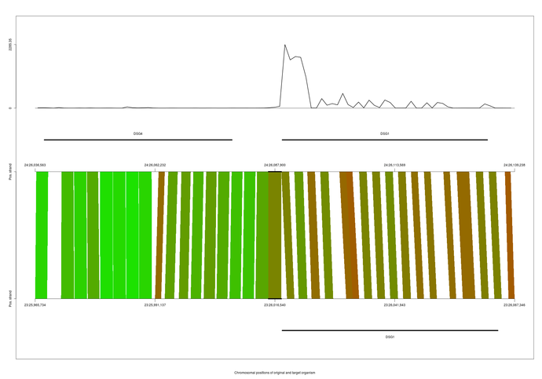

# Installation

The installation of `hoardeR` is straight forward, it is located on Cran and can be installed from within R with the 
command

```{r eval=FALSE}
install.packages("hoardeR")
```

There are no special system requirements for the installation. However, there are a few package dependencies that have to be met.
Normally these dependencies are installed automatically, too. If not, missing Cran packages need then to be installed prior to the
installation as above, with

```{r eval=FALSE}
install.packages("packageName")
```

and missing Bioconductor packages (e.g. the package `Biostrings`) with 

```{r eval=FALSE}
source("https://bioconductor.org/biocLite.R")
biocLite("Biostrings")
```

The latest developer version, of `hoardeR` is located on GitHub, here

&nbsp;&nbsp; <https://github.com/fischuu/hoardeR>

and the address on Cran with the latest stable release version is

&nbsp;&nbsp; <https://cran.r-project.org/package=hoardeR/>

A webpage for the latest news on hoardeR can be found here:

&nbsp;&nbsp; <http://hoarder.danielfischer.name>

Packages from GitHub can be installed directly from R, using the `devtools` package. To install the latest developer version of
`hoardeR` from GitHub, run the following commands

```{r eval=FALSE}
install.packages("devtools")
library("devtools")
install_github("fischuu/hoardeR")
```

Once the package is installed, it can be loaded into the namespace 

```{r, warning=FALSE, eval=FALSE}
library(hoardeR)
```

# Using hoardeR for identifying cross-species orthologs of novel candidate genes

## Typical workflow prior the use of hoardeR

The common application of `hoardeR` is to search cross-species orthologs of unannotated, but active regions in a present organism. For that typically an RNA-seq
experiment has been conducted, the reads have been mapped to a reference genome and gene expressions have been estimated using some annotation.

Further, reads from non-annotated regions have been analysed and a set of novel gene candidate regions has been identified. This can be done either
across the whole data set or individually for each sample. 

From this analysis the user has either a gtf file with novel loci (e.g. Cufflinks provides this), or then a bed file with the new loci. 

The first rows of a typical gtf file would like this:

\tiny

```{bash eval=FALSE}
1       Cufflinks       exon    242203  242862  .       +       .       gene_id "XLOC_000002"; transcript_id "TCONS_00000002"; exon_number "1"; oId "CUFF.2.1"; class_code "u"; tss_id "TSS2";
1       Cufflinks       exon    242203  242646  .       +       .       gene_id "XLOC_000002"; transcript_id "TCONS_00000003"; exon_number "1"; oId "CUFF.1.1"; class_code "u"; tss_id "TSS2";
1       Cufflinks       exon    254559  256717  .       +       .       gene_id "XLOC_000002"; transcript_id "TCONS_00000003"; exon_number "2"; oId "CUFF.1.1"; class_code "u"; tss_id "TSS2";
1       Cufflinks       exon    254240  256717  .       +       .       gene_id "XLOC_000002"; transcript_id "TCONS_00000004"; exon_number "1"; oId "CUFF.3.1"; class_code "u"; tss_id "TSS3";
1       Cufflinks       exon    341982  343630  .       +       .       gene_id "XLOC_000003"; transcript_id "TCONS_00000005"; exon_number "1"; oId "CUFF.10.1"; class_code "u"; tss_id "TSS4";
1       Cufflinks       exon    342113  342607  .       +       .       gene_id "XLOC_000003"; transcript_id "TCONS_00000006"; exon_number "1"; oId "CUFF.11.1"; class_code "u"; tss_id "TSS5";
1       Cufflinks       exon    342961  343494  .       +       .       gene_id "XLOC_000003"; transcript_id "TCONS_00000006"; exon_number "2"; oId "CUFF.11.1"; class_code "u"; tss_id "TSS5";
1       Cufflinks       exon    3312599 3313720 .       +       .       gene_id "XLOC_000024"; transcript_id "TCONS_00000073"; exon_number "1"; oId "CUFF.75.1"; class_code "u"; tss_id "TSS37";
1       Cufflinks       exon    3446776 3447142 .       +       .       gene_id "XLOC_000024"; transcript_id "TCONS_00000073"; exon_number "2"; oId "CUFF.75.1"; class_code "u"; tss_id "TSS37";
1       Cufflinks       exon    9347375 9347527 .       +       .       gene_id "XLOC_000047"; transcript_id "TCONS_00000118"; exon_number "1"; oId "CUFF.115.1"; class_code "u"; tss_id "TSS63";
```

\normalsize

The first lines of a bed file containing the same information would look like this:


```{bash eval=FALSE}
1       242203      242862      XLOC_000002.1
1       242203      242646      XLOC_000002.2
1       254559      256717      XLOC_000002.3
1       254240      256717      XLOC_000002.4
1       341982      343630      XLOC_000003.1
1       342113      342607      XLOC_000003.2
1       342961      343494      XLOC_000003.3
1       3312599     3313720     XLOC_000024.1
1       3446776     3447142     XLOC_000024.2
1       9347375     9347527     XLOC_000047.1
```

For the identification of cross-species orthologs, the exon structure is not the primary interest. Rather, the whole genomic region that hosts a novel candidate gene is
used here. Typically not all novel gene candidates are considered and the list is filtered according to some criteria e.g., that a certain amount of samples have to have a minimum number of reads in that region.

The final set of regions of interest is then available in bed format, e.g. like this

```{bash eval=FALSE}
1       242203      256717      XLOC_000002
1       341982      343630      XLOC_000003
1       3312599     3447142     XLOC_000024
1       9347375     9347527     XLOC_000047
```

## Extraction of nucleotide sequence of novel candidate region

For any loci of interest the nucleotide sequences have to be extracted. There are two ways to do that. The first option is to do it outside of R using bedtools. For that, the
bed file has to be saved to the harddrive first. Assuming the `data.frame` that contains the bed information is called `novelBed` and we have a defined system path to the project, called `projFolder`. An example command to export the data frame `novelBed` then is

```{bash eval=FALSE}
projFolder <- "/home/daniel/MyProjects/hoardeR-Example"
exportBed(novelBed, file=file.path(projFolder,"novel.bed"))
```

In the console this bed file can then be used to extract the fasta files, using `bedtools` like this

```{bash eval=FALSE}
bedtools getfasta -fi <input FASTA> -bed novel.bed -fo novel.fa
```

Here, `<input FASTA>` is a fasta file that contains the genome information of the species under investigation. If the resulting `novel.fa` file is empty or
some other errors occur, a common source of error is a mislabeling of the chromosomes between the input fasta file and the corresponding bed file (e.g. leading CHR, Chr, etc.). Extracting the sequences in such a way is especially then adviceable, when the species of interest is rare or the fasta file is not available from Ensembl in the latest version.

However, if the species and also the genome assembly version is available from Ensembl, the fasta information can be obtained straight with the `hoardeR` function
`getFastaFromBed`. The `hoardeR` package is able to directly download the genomes and annotations of the most common species, a list of available combinations can be found in the `species` dataset, that comes with `hoardeR`


```{r eval=FALSE}
head(species)
```

\tiny
```{r eval=FALSE}
       Common.name         Scientific.name Taxon.ID       Ensembl.Assembly       Accession Variation.database Regulation.database Pre.assembly
1   Aardvark (Pre)   Orycteropus afer afer  1230840                      -               -                  -                   -      OryAfe1
2           Alpaca           Vicugna pacos    30538                vicPac1               -                  -                   -            -
3     Amazon molly        Poecilia formosa    48698 Poecilia_formosa-5.1.2 GCA_000485575.1                  -                   -            -
4     Anole lizard     Anolis carolinensis    28377              AnoCar2.0 GCA_000090745.1                  -                   -            -
5        Armadillo    Dasypus novemcinctus     9361              Dasnov3.0 GCA_000208655.2                  -                   -            -
6 Budgerigar (Pre) Melopsittacus undulatus    13146                      -               -                  -                   -    MelUnd6.3
```
\normalsize

Of particular interest are here the columns `Scientific.name` and `Ensembl.Assembly`. If your species of interest and your used assembly matches with the information in the `species` table, you can use the automatic
`hoardeR` function `getFastaFromBed` with the default settings to obtain your fasta object. Here, we assume that our species of interest is cow respective bos taurus and the fasta files should be
downloaded to the folder `/home/daniel/fasta/`. From the `species` table we see that, if no further information are provided then the assembly version `UMD3.1` is downloaded.

```{r eval=FALSE}
novelBed <- data.frame(Chr=c(11,18,3),
                       Start=c(72554673, 62550696, 18148822),
                       End=c(72555273, 62551296, 18149422),
                       Gene=c("LOC1", "LOC2", "LOC3"))

myFasta <- getFastaFromBed(novelBed, species="Bos taurus", 
                           fastaFolder="/home/daniel/fasta/")
```

With the same command it is also possible to obtain the genomic information from assemblies that are published under a different Ensembl release, or that are not at Ensembl or that have a newer/older assembly version. For that, the full syntax is

```{r eval=FALSE}
myFasta <- getFastaFromBed(novelBed, species="Bos taurus", release = "84", 
                           fastaFolder="/home/daniel/fasta/", version=NULL)
```

Here, the Ensembl release version and also the assembly version can be specified. However, if no release number is given (i.e. `release=NULL`), the function assumes
to find a non-Ensembl fasta file in the folder `fastaFolder`. The naming of these fasta files need then to be of the following format, e.g. for the cow assembly version UMD3.1

```{r eval=FALSE}
Bos_taurus.UMD3.1.dna.chromosome.1.fa.gz
Bos_taurus.UMD3.1.dna.chromosome.2.fa.gz
Bos_taurus.UMD3.1.dna.chromosome.3.fa.gz
...
```

That means, first the scientific name, with underscores, then a dot, then the assembly identifier followed by another dot, then `dna.chromosome.` and the chromosome
identifier, and then the file extension `fa.gz`. That means, the fasta files have to be gzipped.

Consider now an example where the genome is not available from Ensembl. On Ensembl is only the sheep genome assembly 'Oar\_v3.1', if one needs to work with the 'Oar\_v4.0', one would download the chromosome-wise files and then store them in some folder on the harddrive as 

```{r eval=FALSE}
Ovis_aries.Oar_v4.0.dna.chromosome.1.fa.gz
Ovis_aries.Oar_v4.0.dna.chromosome.2.fa.gz
Ovis_aries.Oar_v4.0.dna.chromosome.3.fa.gz
...
```

To obtain then the corresponding fasta objects (of class `fa`), the command is

```{r eval=FALSE}
myFasta <- getFastaFromBed(novelBed, species="Ovis aries", release = NULL, 
                           fastaFolder="/home/daniel/fasta/", version="Oar_v4.0")
```

assuming again that the fasta files are located in `/home/daniel/fasta/`.

The option to extract the fasta sequences via bedtools is, however, much faster and is the recommended way. The internal function is especially useful for small bed files or fast testing purposes. An `fa`-object can be stored
to the harddrive via

```{r eval=FALSE}
exportFA(myFasta, file="/home/daniel/myFasta.fa")
```

A previously stored or downloaded fasta file can be imported to `hoardeR` with the `importFA()` function:

```{r eval=FALSE}
novelFA <- importFA(file="/home/daniel/myFasta.fa")
```

The names of the fasta sequences should follow the form like

```{r eval=FALSE}
>Chr:Start-End
```

That means, for a sequence from chromosome 12 that starts at 123 and ends at 456 the fasta sequence should be named like the following.

```{r eval=FALSE}
>12:123-456
```

## Sending sequences to NCBI

Once the fasta object is available in R, it can be send to the NCBI blast service, using the central `hoardeR` function `blastSeq()`

```{r eval=FALSE}
  blastSeq(novelFA, 
           email="daniel.fischer@luke.fi",
           xmlFolder=file.path(projFolder,"hoardeROut/"),
           logFolder=file.path(projFolder,"hoardeRLog/"),
           keepInMemory=FALSE)
```           

The main parameters are the fasta object (here called `novelFA`), then for etiquette reasons a valid email address of the person who sends the data to NCBI and
the required folder locations on the harddrive. The folder needs to exist on the HDD, `hoardeR` would not create a novel parent folder for the log files.

The `xmlFolder` stores the results that are delivered from NCBI in xml format and the `logFolder` stores the log files. These files are
especially then important, when the run crashes and should be continued or if the computer is switched off in between. in that case, obviously no new sequences
are sent anymore to NCBI.

If a crashed run should be continued, it is enough to run the same command as the initially one using the same fasta object and `hoardeR`
will continue from the point, where it crashed or where it was interrupted. If the option `verbose=TRUE` is set (default), `hoardeR` keeps 
reporting status updates of the blast runs. There are still some fine-tuning parameters available, see the manual for details. However,
there are some etiquette parameters of NCBI that cannot be changed to smaller values than the defaults. These are e.g. the frequency of the requests and the total amount of parallel blast runs.

The verbose output of a `blastSeq` runs straight after executing the command looks as follows

```{r eval=FALSE}
Missing: 3 
Running: 1 
Finished: 0 
Avg. Blast Time: 00:00:00 
Total running time: 00:00:04 
---------------------------------------------------------------
```

indicating e.g. that here are still three fasta sequences waiting to be finished, one sequence is already running an NCBI, zero are finished so
far and the running time of the whole run is 4 seconds. After a while (option `delay_rid`), `blastSeq` starts to check, if the active blast runs are
finalized. If there are still free blast slots available (maximum number is defined via `n_blast` option), `blastSeq` spawns the next ones. In that case, the verbose output looks like this:

```{r eval=FALSE}
Run RW99J31C01R : 00:02:23 
Missing: 1 
Running: 1 
Finished: 2 
Avg. Blast Time: 00:01:10 
Total running time: 00:02:40 
---------------------------------------------------------------
```

Here, we see that there is still one sequence missing and one is also running. The ID number of that run is `RW99J31C01R` and it is
active since 2 minutes and 23 seconds. So far, two sequence runs are ready and their average running time was 1 minute and 10 seconds.

The function stops, when there are neither missing nor running sequences anymore. The results of the run are stored in the `xmlFolder`. These results
can already be analyzed while the `blastSeq` run is still active, so intermediate results can be obtained on the fly. For that, just open another instance of R and continue to analyze the Blast results.

## Analyze the Blast Results

To analyze the blast results, first the xml files have to be imported to `hoardeR`. For that there is the `importXML()` function.
It expects the folder address where the xml files are stored, in our example it is the `hoardeROut` folder in the `projFolder` folder.

```{r eval=FALSE}
xmls <- importXML(folder=file.path(projFolder,"hoardeROut/"))
```

One of the first steps is to check what hit organisms were found. As naturally all sequences are also found in Bos Taurus/Cow, the
host organism can be excluded from the table

```{r eval=FALSE}
R> tableSpecies(xmls, exclude="Bos taurus")
```
  
This table can be displayed as barplot e.g. in the following way

```{r eval=FALSE}
R> par(oma=c(5,0,0,0))
R> barplot(sort(tableSpecies(xmls, exclude="Bos taurus"), decreasing=TRUE), las=2)
```

Next the hits for the Sus scrofa/Pig will be visualized. For that, the xml results will be first filtered accordingly. For that
also the tableSpecies command is used. This time, however, a species is not excluded with the `exclude` option, but explicitely defined
with the `species` parameter. Further, instead of just counting the occurances, we request in addition the location information by
setting `locations=TRUE`:

```{r eval=FALSE}
R> tableSpecies(xmls, species="Sus scrofa", locations = TRUE)
```

\scriptsize
```{r eval=FALSE}
                                           Organism hitID hitLen hitChr  hitStart    hitEnd origChr origStart  origEnd
28 Sus scrofa breed mixed chromosome 4, Sscrofa10.2   494    644      4 105815870 105816509       3  18148822 18149422
```
\normalsize

without the `locations=TRUE` option, the output is very minimalistic, as it just gives the frequencies:

```{r eval=FALSE}
R> tableSpecies(xmls)
  
Bos taurus Equus caballus     Sus scrofa     Ovis aries 
         6              1              1              3 
```

Especially when a single species is defined, without setting `locations=TRUE` the function just gives the frequency.         
         
```{r eval=FALSE}
R> tableSpecies(xmls, species="Sus scrofa")
Sus scrofa 
         1 
```

The column `Organism` indicates the hit organism and the corresponding assembly. In this case it is Sus scrofa and Sscrofa10.2. Cross-checking with the `species` data table
reveals, that this assembly is the default assembly at Ensembl:
```{r eval=FALSE}
R> species[grepl("Sus scrofa", species$Scientific.name),]       
```

\scriptsize

```{r eval=FALSE}
         Common.name Scientific.name Taxon.ID Ensembl.Assembly       Accession Variation.database Regulation.database Pre.assembly
57               Pig      Sus scrofa     9823      Sscrofa10.2 GCA_000003025.4                  Y                   Y            -
58 Pig FPC_map (Pre)  Sus scrofa map       NA                -               -                  -                   -          MAP      
```

\normalsize

That means that the assembly can be obtained automatically from `hoardeR` for further analysis without using any additional parameters. The command `getAnnotation` downloads automatically the corresponding annotation into the specified folder (here: `/home/daniel/annotation`):

```{r eval=FALSE}
R> ssannot <- getAnnotation(species = "Sus scrofa", 
+                           annotationFolder="/home/daniel/annotation")
```

Having the annotation information available from Ensembl, we can intersect the Blast results with the annotation. First we check if the found loci intersect with an intergenic region in the Sus scrofa genome. Here, we assume that more than one hit was found and results would be stored in a list

```{r eval=FALSE}
R> pigHits <- tableSpecies(xmls, species="Sus scrofa", locations = TRUE)
R> pigInter <- list()
R> for(i in 1:nrow(pigHits)){
R>   pigInter[[i]] <- intersectXMLAnnot(pigHits[i,], ssannot)
R> }
```

However, unfortunately there is no intersection:

```{r eval=FALSE}
R> pigInter
[[1]]
Empty data.table (0 rows) of 15 cols: V1,V2,V3,V4,V5,V6...
```

Hence, we allow for a larger seach area and add flanking sites of 100kB to each side of the search area (that means, 100kB are added to each side of the annotated regions), using the option `flanking=100` in 
the `intersectXMLAnnot()` function:

```{r eval=FALSE}
R> pigInter.flank <- list()
R> for(i in 1:nrow(pigHits)){
R>   pigInter.flank[[i]] <- intersectXMLAnnot(pigHits[i,], ssannot, flanking=100)
R> }
# This part transforms the list into a data frame and removes those 'hits' that
# do not report any intersection
R> pigInter.flank <- pigInter.flank[sapply(pigInter.flank,nrow)>0]
R> pigInter.flank <- do.call(rbind, pigInter.flank)

```

This results in an intersection:

\tiny
```{r eval=FALSE}
R> pigInter.flank
   V1      V2   V3        V4        V5 V6 V7 V8                                                                                                    V9 origChr origStart  origEnd hitChr  hitStart    hitEnd
1:  4 ensembl gene 105858080 105858409  .  -  . gene_id "ENSSSCG00000006603"; gene_version "2"; gene_source "ensembl"; gene_biotype "protein_coding";       3  18148822 18149422      4 105815870 105816509
```
\normalsize

The intersections contains first the annotation information as provided by the annotation file and then in addition the location of the hit in the
host organism (`origChr`, `origStart`, `origEnd`) and in the hit organism (`hitChr`, `hitStart`, `hitEnd`).

## Visualize the intersected Blast results

In order to visualize the results the `plotHit` function can be used. In its basic usage, it only plots the similarity between the 
original and the hit organism like this:

```{r eval=FALSE}
R>        plotHit(
+             hits=pigInter.flank,
+             flanking=100,
+             diagonal=0.25 ,
+             hitSpecies = "Sus scrofa",
+             origSpecies = "Bos taurus",
+             fastaFolder = "/home/ejo138/fasta/",
            # The following options are optional
+             window=NULL , 
+             which=NULL,
+             figureFolder = "/home/daniel/figures/",
+             figurePrefix = "pigIS"
+             ) 
```

The parameters are then as follows. `hits` expects the `data.frame` from above with the intersected hits. If `hits` receives a `data.frame` with more than one row (i.e. several hits were found) a `figureFolder` should be provided, as for each hit a separate plot will be created. For example, with the above optional parameters a figure for each hit will be created in the folder `/home/daniel/figures/`, using the prefix `pigIS`. However, if only a single figure should be
created, without storing it directly to the hard drive, one would drop the `figureFolder` and `figurePrefix` parameters (they are `NULL` by default)
and instead specify in the `which` option, which hit should be plotted. An alternative would be to restrict the matrix given to the `hits` 
option, e.g. for seeing the first hit only, one would use the option `hits=pigInter.flank[1,]`.

The other required options control the behavior of the plot. The `flanking` option defines the plotting area around the hit in Mb and the `diagonal` option is a threshold for the minimum similarity after that a similarity line should be plotted. As higher that value (between 0 and 1) as more restrictive it is and
as less similarity lines will be used in the plot. The two parameters `hitSpecies` and `origSpecies` define the two organisms that should
be compared. In our case the original organism was Bos taurus/cow and the hit was Sus scrofa/pig. The location of the corresponding fasta 
files (or to where they should be stored), is defined in the `fastaFolder` option. Again, if the assembly is the same as in the `species`
dataset, the fasta files will be automatically fetched from the Ensembl page. In case a tailored assembly is required, it can be specified
with additional options, see the manual or a later example for further instructions on that. 

The similarity is calculated using a shifting window approach. That means, the plotting area is divided into chunks of a certain length,
defined with the `window` option. By default that window has the similar length as the hit-sequence has, but an own value can be defined
in the `window` option. Our function then tests all pairwise combinations between the chunks of the original organism and the hit organism,
calculates the similarity between them and stores the best result. That way, each chunk/window of the original organism gets assigned a chunk from the hit organism. Only those combinations are then considered further, that are at least having a similarity value as defined in `diagonal`.

With that, the figure for the pig would look like this:

```{r, fig.retina = NULL, fig.cap="Similarity between Pig and Cow", echo=FALSE}
knitr::include_graphics("./pigFlanking.png")
```

On the top part of the plot the annotation of Bos taurus is plotted, on the bottom part the one of Sus scrofa, followed by the axes of the chromosomal regions. The vertical center line indicates the hit, further highlighted with the black spots on the chromosomal regions. It appears that
this region is rather similar, although in the case of Bos taurus it seems that the genomic region is a bit stretched, as the lines are 
not parallel but open up towards the Bos taurus side. Also, it seems that the identified gene in the flanking region corresponds to an 
already annotated gene in Bos taurus.

We continue with examining the same hit for Ovis aries/sheep. Here we have

```{r eval=FALSE}
R> tableSpecies(xmls, species="Ovis aries", locations = TRUE)
```

\tiny

```{r eval=FALSE}
                                                                        Organism hitID hitLen hitChr  hitStart    hitEnd origChr origStart  origEnd
8   Ovis aries breed Texel chromosome 3, Oar_v4.0, whole genome shotgun sequence   577    616      3  33956005  33955391      11  72554673 72555273
16 Ovis aries breed Texel chromosome 14, Oar_v4.0, whole genome shotgun sequence   553    613     14  59259439  59260042      18  62550696 62551296
24  Ovis aries breed Texel chromosome 1, Oar_v4.0, whole genome shotgun sequence   539    604      1 101361981 101362569       3  18148822 18149422
```

\normalsize

Indicating that the hit comes from the Oar\_v4.0 assembly. However, in Ensembl is only the Oar\_v.3.1 assembly and hence, the automatic
download would use the wrong assembly and consequently also would operate on the wrong coordiantes. Hence, the correct assembly has to
be downloaded from the Ovis aries consortium or NCBI and stored as chromosome-wise fasta files in the fasta folder. Same holds also for the
annotation files. 

From the NCBI page we can download the Ovis aries annotation in gff format and we copy the file into the `/home/daniel/Annotations/` folder,
using the filename `Ovis_aries.Oar_v4.0.NCBI.chr.gff.gz`. The naming follows again the same scheme, first is the scientific name of the
organism with underscores, then is the assembly version, then the release source (or Ensembl release version), followed by the required file ending. Please notice that the
annotation needs to be zipped. The annotation can then be loaded to `hoarder` again with `getAnnotation()` command, specifying the required
parameters.

```{r, eval=FALSE}
R> oaannot4.0 <- getAnnotation(species = "Ovis aries", release="NCBI", version="Oar_v4.0", 
+                              type="gff", annotationFolder="/home/daniel/Annotations/")
```

The blast hits are imported as before with

```{r eval=FALSE}
R> oaHits <- tableSpecies(xmlNew, species="Ovis aries", locations=TRUE)
```

In order to adjust the namings, some additional hand-on is required, e.g. in the following type of way:

```{r eval=FALSE}
R> for(i in 0:24){
+    refName <- paste("NC_0",19458+i,".2",sep="") 
+    oaannot4.0$V1[oaannot4.0$V1==refName] <- i+1
+   }
R> i <- 25
R> refName <- paste("NC_0",19458+i,".2",sep="") 
R> oaannot4.0$V1[oaannot4.0$V1==refName] <- "X"
```

With that the intersections between the hits and the annotation using a flanking side of 50Mb can be calculated and then finally merged into a data frame.

```{r eval=FALSE}
R> sheepInter4.0 <- list()
R> for(i in 1:nrow(oaHits)){
+    sheepInter4.0[[i]] <- intersectXMLAnnot(oaHits[i,], oaannot4.0, flanking=50)
+  }

R> sheepInter4.0 <- sheepInter4.0[sapply(sheepInter4.0,nrow)>0]
R> sheepInter4.0 <- do.call(rbind, sheepInter4.0)
```

The following command will create then the visualization

```{r eval =FALSE}
      plotHit(
            hits=sheepInter4.0,
            flanking=50,
            window=NULL , 
            diagonal=0.25 ,
            hitSpecies = "Ovis aries",
            hitSpeciesVersion = "Oar_v4.0",
            origSpecies = "Bos taurus",
            fastaFolder = "/home/daniel/fasta/",
            origAnnot=btannot,
            hitAnnot=oaannot4.0,
            coverage=TRUE,
            bamFolder = "/home/daniel/bams/",
            which=1:2,
            figureFolder = "/home/daniel/figures/",
            figurePrefix = "sheepNOVEL"
              )
```

Here, more optional parameters are used. These are, in addition to the already previous used ones, the definition of the used hit species version 
in `hitSpeciesVersion`. Further, the logical flag `coverage=TRUE` is set. If this is the case, the function expects to find bam files in a folder
defined in `bamFolder` that contain information about the coverage. The plot that shows in addition then also the coverage would look this this:

```{r, fig.retina = NULL, fig.cap="Similarity between Sheep and Cow", echo=FALSE}

```
By default all bam files located in the `bamFolder` are taken and the average is taken. However, the filenames of single bam files can also be given to the `bamFiles` option. In case of a case/control study, it might be desirable to plot two different coverage curves. For that, the `groupIndex` defines to which group a bam file belongs and the color of the corresponding coverage is then defined in `groupColor`.